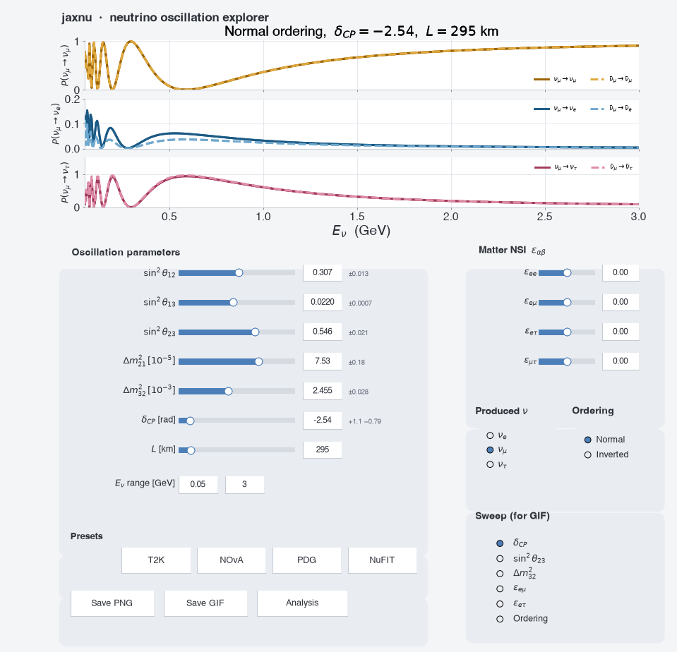

# nuosc-explorer

An interactive explorer for three-flavour neutrino oscillations, built on
[jaxnu](https://github.com/pgranger23/jaxnu-osc). Drag or type oscillation
parameters and matter-NSI couplings and watch all four channels update live;
load published parameter sets; export talk-ready PNGs and animated GIFs; and
open an optional analysis window that uses jaxnu's automatic differentiation.



---

## Features

**Main window**
- Live curves for `νμ→νμ`, `ν̄μ→ν̄μ` (gold) and `νμ→νe`, `ν̄μ→ν̄e` (blue),
  in constant-density matter.
- Sliders **and** typed entry boxes for `sin²θ12, sin²θ13, sin²θ23, Δm²21,
  Δm²32, δCP`, the baseline `L`, and the neutrino energy range.
- Matter **NSI** couplings `ε_ee, ε_eμ, ε_eτ, ε_μτ` (all zero → standard
  oscillations).
- **Presets** (T2K / NOvA / PDG / NuFIT) that load central values *and* show
  each parameter's ± uncertainty.
- Normal / Inverted ordering toggle.
- Appearance panel **autoscales** in *y*; the energy range controls *x*.
- **Save PNG** (300-dpi PNG + vector PDF) and **Save GIF** (sweeps a chosen
  parameter, including NSI couplings and the mass ordering).

**Analysis window** (opened on demand — uses `jax.jacfwd` / `jax.grad`)
- **Sensitivity** — exact `∂P/∂parameter` vs energy.
- **Uncertainty band** — `P ± 1σ` propagated through the Jacobian.
- **Fit contour** — Asimov Δχ² contours over a selectable pair of parameters,
  with a gradient-descent fit overlaid.

---

## Installation

Requires Python ≥ 3.10. `jaxnu` is not on PyPI, so install it from git.

```bash
git clone https://github.com/lauramunteanu/nuosc-explorer.git
cd nuosc-explorer

python -m venv .venv && source .venv/bin/activate     # or: conda create -n nuosc python=3.12
pip install git+https://github.com/pgranger23/jaxnu-osc.git
pip install -e .
```

Or in one step with the extra:

```bash
pip install -e ".[jaxnu]"
```

## Usage

```bash
nuosc-explorer                     # open the interactive GUI
nuosc-explorer --snapshot          # headless: write figures/gui_snapshot.png|pdf
nuosc-explorer --snapshot --preset NuFIT --outdir out
```

Or from Python:

```python
from nuosc_explorer import app
gui = app.main()          # opens the window and blocks
```

Figures are written to `./figures` by default; override with `--outdir` or the
`NUOSC_FIGDIR` environment variable.

The GUI needs an interactive matplotlib backend. On macOS the default `macosx`
backend works; elsewhere install Tk (`python3-tk`) or Qt and set
`MPLBACKEND=TkAgg`.

---

## Deployment

**The interactive GUI is a desktop application** (matplotlib widgets) — it needs
a display and cannot be served from static hosting such as GitHub/GitLab Pages.
Two things *are* deployable:

**1. Headless figure generation** (CI, batch jobs, containers) — no display
required:

```bash
docker build -t nuosc-explorer .
docker run --rm -v "$PWD/out:/out" nuosc-explorer --snapshot --outdir /out
```

This is the mode to use in a CI pipeline that regenerates figures for a talk or
a web page.

**2. A web front-end** — to run this interactively in a browser you need a
server-side app (Streamlit/Dash/Gradio on a host that can run Python, e.g. an
OpenShift/PaaS project) or a client-side reimplementation of the physics in
JavaScript for static hosting. The compute layer here (`app.compute`,
`app.build_params`, `app.build_nsi`) is deliberately separated from the widgets
so it can be reused by such a front-end. **This repository does not ship a web
app.**

---

## Caveats — please read before using in a talk

- **The preset numbers are approximate.** They were entered from memory,
  rounded, and assume normal ordering. Verify each against the reference you
  intend to cite. They all live in one `PRESETS` dict at the top of
  `nuosc_explorer/app.py` and are trivial to correct.
- **The fit contour is illustrative only.** It is an Asimov exercise: the "data"
  are the probabilities at your current slider values, with *invented* per-bin
  errors (0.010 appearance / 0.050 disappearance over ~25 energy points). There
  are no event rates, fluxes, cross-sections or systematics, and nothing is
  marginalised — every parameter other than the two on the axes is held fixed.
  The best fit therefore sits exactly on the truth by construction; the contours
  show the resulting uncertainty region, and the gradient-fit marker only
  demonstrates that the optimiser converges. **It is not a sensitivity study.**
- The uncertainty text beside each parameter reflects the **last preset loaded**;
  it does not update if you then edit a value by hand.
- Matter effects use a **constant density** (2.6 g/cm³, Yₑ = 0.5), appropriate
  for crustal baselines. For long paths through the Earth use jaxnu's
  `probability_earth` (PREM) instead.

## Licence

MIT — see [LICENSE](LICENSE). The physics is computed by
[jaxnu](https://github.com/pgranger23/jaxnu-osc) (also MIT).
